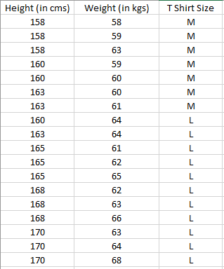
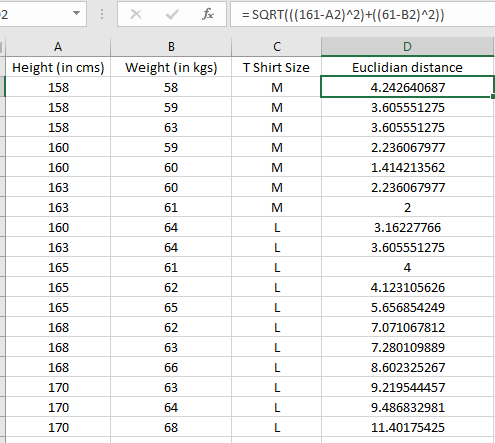
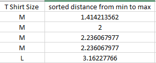

# KNN Algorithm

#### What is KNN Algorithm?

 **K nearest neighbors or KNN** Algorithm is a simple algorithm which uses the entire dataset in its `training phase`. Whenever a `prediction` is required for an `unseen data` instance, it searches through the entire training dataset for `k-most` similar instances and the data with the most similar instance is finally returned as the `prediction`.
 
#### Where to use KNN

KNN is often used in simple recommendation systems, image recognition technology, and decision-making models. It is the algorithm companies like Netflix or Amazon use in order to recommend different movies to watch or books to buy. Netflix even launched the Netflix Prize competition, awarding $1 million to the team that created the most accurate recommendation algorithm!

You might be wondering, **_“But how do these companies do this?”_** Well, these companies will apply KNN on a data set gathered about the movies you’ve watched or the books you’ve bought on their website. These companies will then input your available customer data and compare that to other customers who have watched similar movies or bought similar books. This data point will then be classified as a certain profile based on their past using KNN. The movies and books recommended will then depend on how the algorithm classifies that data point.

#### How does a KNN Algorithm work?

The k-nearest neighbors algorithm uses a very simple approach to perform classification. When tested with a new example, it looks through the training data and finds the k training examples that are closest to the new example. It then assigns the most common class label (among those k-training examples) to the test example.

#### What does ‘k’ in kNN Algorithm represent?

>  k in kNN algorithm represents the number of nearest neighbor points which are voting for the new test data’s class.

If k=1, then test examples are given the same label as the closest example in the training set.

If k=3, the labels of the three closest classes are checked and the most common (i.e., occurring at least twice) label is assigned, and so on for larger ks.

## The KNN Algorithm

1. Load the data
2. Initialize K to your chosen number of neighbors
3. For each example in the data,
   - Calculate the distance between the query example and the current example from the data.
   - Add the distance and the index of the example to an ordered collection
4. Sort the ordered collection of distances and indices from smallest to largest (in ascending order) by the distances
5. Pick the first K entries from the sorted collection
6. Get the labels of the selected K entries
7. If regression, return the mean of the K labels
8. If classification, return the mode of the K labels

## KNN Algorithm manual implementation

Let’s consider this example,

Suppose we have height and weight and its corresponding Tshirt size of several customers. Your task is to predict the T-shirt size of Anna, whose height is 161cm and her weight is 61kg.

**unseen data :**
- height : 161 cm
- weight : 61 kg

**Step 1:**

Calculate the Euclidean distance between the new point and the existing points.

For example, Euclidean distance between point P1(1,1) and P2(5,4) is:

**Step 2:**

Choose the value of K and select K neighbors closet to the new point.
In this case, select the top 5 parameters having least Euclidean distance.

**Step 3:**

Count the votes of all the K neighbors / Predicting Values
Since for K = 5, we have 4 Tshirts of size M, therefore according to the kNN Algorithm, Anna of height 161 cm and weight, 61kg will fit into a Tshirt of size M.

 
 
 

