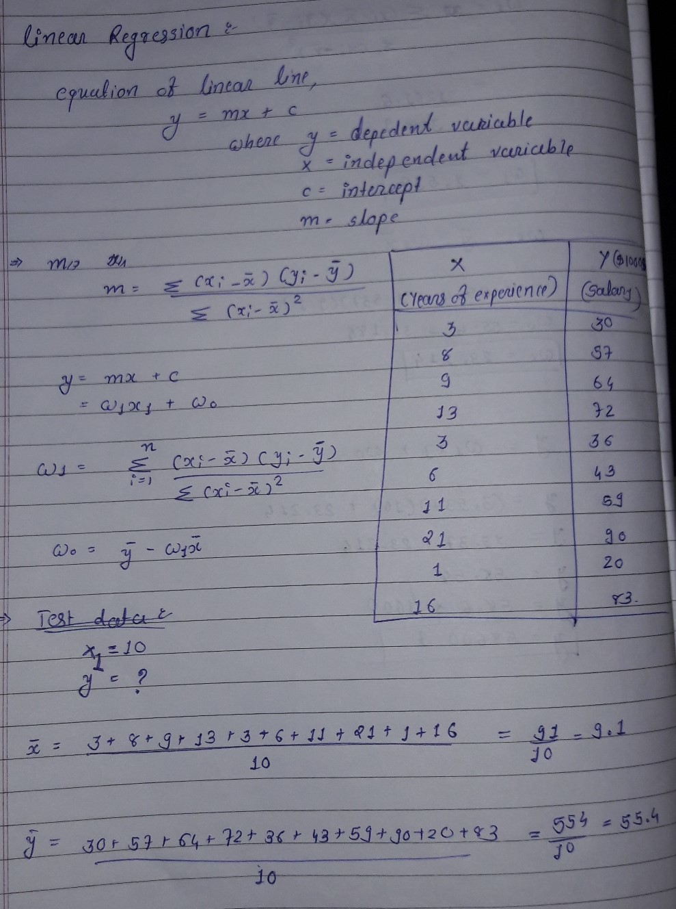
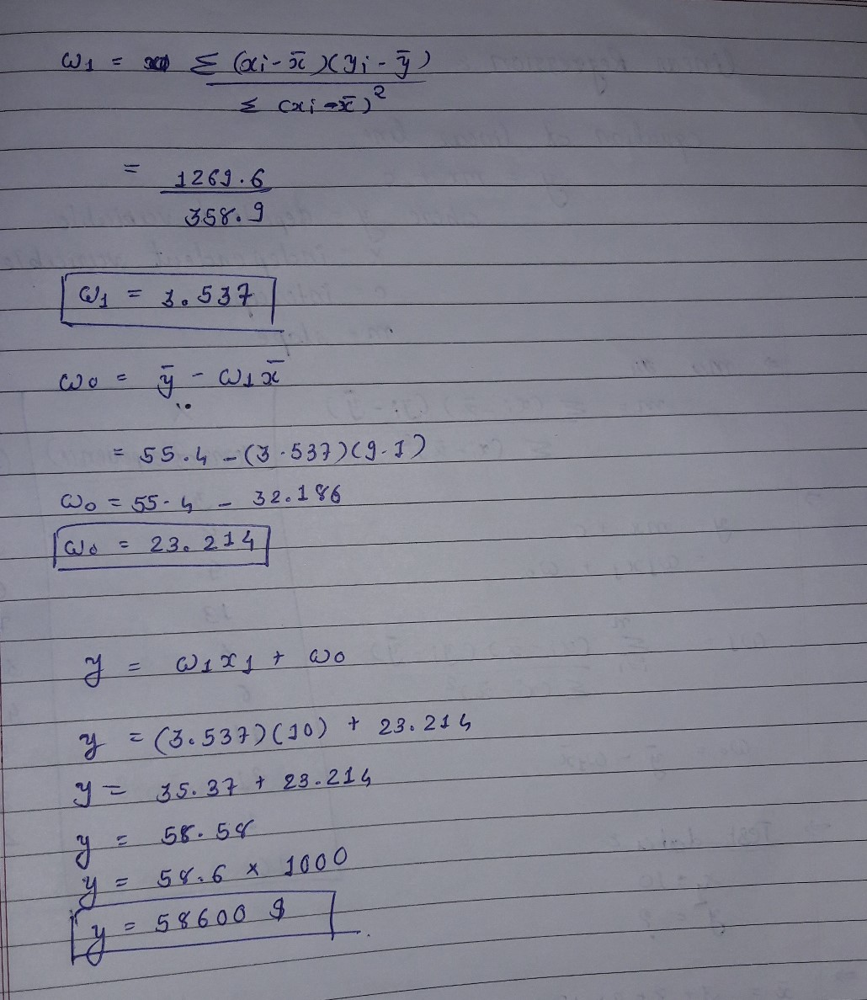

# Linear Regression

### What is Linear Regression ?

A linear regression is one of the easiest statistical models in machine learning. It is used to show the linear relationship between a `dependent variable` and one or more `independent variables`.

let me just give you a quick overview of what is a regression as Linear Regression is one of a type of Regression algorithm.

**What is Regression?**

 Regression analysis is a form of predictive modelling technique which investigates the relationship between a dependent and independent variable.
 
### Types of Regression

- Linear Regression
- Logistic Regression
- Polynomial Regression
- Stepwise Regression

### Linear Regression VS Logistic regression

| Basis |	Linear Regression |	Logistic Regression|
|--|--|--|
|Core Concept	|The data is modelled using a straight line|	The data is modelled using a sigmoid|
|Used with|	Continuous Variable|	Categorical Variable|
|Output/Prediction|	Value of the variable|	Probability of occurrence of an event
Accuracy and Goodness of Fit|	Measured by loss, R squared, Adjusted R squared etc.|	Measured by Accuracy, Precision, Recall, F1 score, ROC curve, Confusion Matrix, etc|

### Where is linear regression used ?

1. **Evaluating Trends and Sales Estimates** 
   
   Linear regressions can be used in business to evaluate trends and make estimates or forecasts.
    **For example,** if a company’s sales have increased steadily every month for the past few years, conducting a linear analysis on the sales data with monthly sales on the y-axis and time on the x-axis would produce a line that that depicts the upward trend in sales. After creating the trend line, the company could use the slope of the line to forecast sales in future months.
    
2. **Analyzing the Impact of Price Changes**
    
    Linear regression can also be used to analyze the effect of pricing on consumer behaviour.
    **For example,** if a company changes the price on a certain product several times, it can record the quantity it sells for each price level and then performs a linear regression with quantity sold as the dependent variable and price as the explanatory variable. The result would be a line that depicts the extent to which consumers reduce their consumption of the product as prices increase, which could help guide future pricing decisions.
    
3. **Assessing Risk**
    
    Linear regression can be used to analyze risk.
    **For example,** A health insurance company might conduct a linear regression plotting number of claims per customer against age and discover that older customers tend to make more health insurance claims. The results of such an analysis might guide important business decisions made to account for risk.

## Least Square Method - Finding the best fit line

**Least squares is a statistical method used to determine the best fit line or the regression line by minimizing the sum of squares created by a mathematical function. The “square” here refers to squaring the distance between a data point and the regression line. The line with the minimum value of the sum of square is the best-fit regression line.** 

Regression Line, **y = mx+c** where,

y = Dependent Variable

x= Independent Variable ; c = y-Intercept

#### Example for Least Square Method

## R Square Method - Goodness of Fit

**R–squared** value is the statistical measure to show how close the data are to the fitted regression line.

y = actual value

y ¯ = mean value of y

yp =  predicted value of y

R-squared does not indicate whether a regression model is adequate. You can have a low R-squared value for a good model, or a high R-squared value for a model that does not fit the data!
