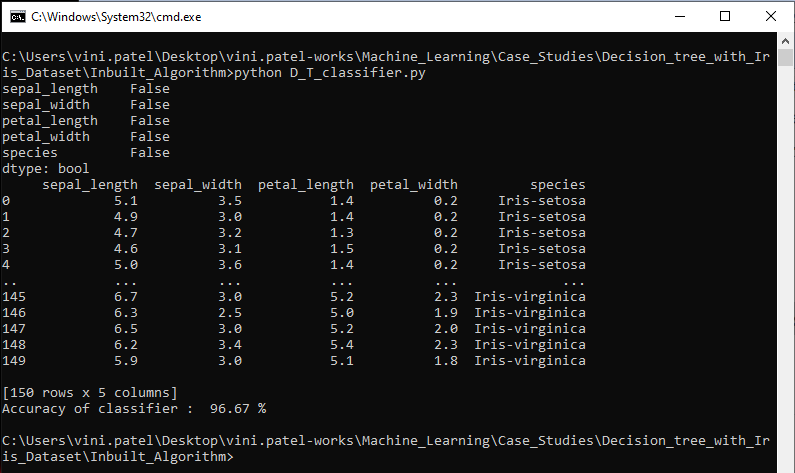

# Ball_Prediction Case Study

### Problem statement:

> To create an iris (name of a flower) classifier based on a given properties that are the sepal and petal size.

### Dataset Description

The dataset includes three iris species with 50 samples each as well as some properties about each flower. The available columns in this dataset are: Id, SepalLengthCm, SepalWidthCm, PetalLengthCm, PetalWidthCm, and Species.

### Library Installation

> pip install sklearn

> pip install pandas

> pip install numpy

> pip install matplotlib

> pip install seaborn

### Algorithm

> DecisionTreeClassifier from sklearn

### Initial script

**Import and Check The Dataset**

Firstly, we will import several dependencies such as pandas, numpy, seaborn, and also several modules in scikit-learn. We also going to read the Iris CSV file into our python code.

```
import pandas as pd
import numpy as np
import seaborn as sns
import matplotlib.pyplot as plt

from sklearn.model_selection import train_test_split
from sklearn.tree import DecisionTreeClassifier

df = pd.read_csv('IRIS.csv')
```

### Splitting The Dataset
Since there is only one dataset available (no separated training and test dataset) we need to divide the dataset into training and test dataset by ourself. To do this, we can use the train_test_split method from the scikit-learn. Don’t forget to split the input and output column to different arrays.

```
all_inputs = df[['sepal_length', 'sepal_width', 'petal_length', 'petal_width']].values

target_lables = df['species'].values

(train_inputs, test_inputs, train_classes, test_classes) = train_test_split(all_inputs, target_lables, train_size=0.8, random_state=1)

```

### Classification
```
model = DecisionTreeClassifier()
​
model.fit(train_inputs, train_classes)
​
model.score(test_inputs, test_classes)   # Calculate accuracy of the model
```

### Output



