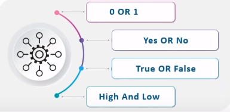
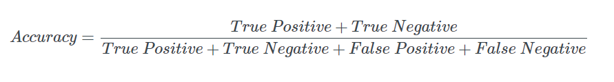
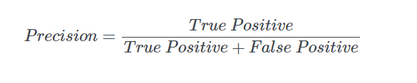
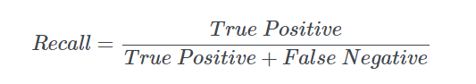
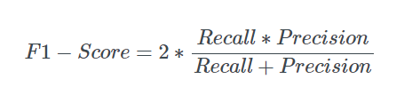

# Logistic Regression

Logistic regression is a statistical method for predicting binary classes. The outcome or target variable is dichotomous in nature. Dichotomous means there are only two possible classes. For example, it can be used for cancer detection problems. It computes the probability of an event occurrence.

It is a special case of linear regression where the target variable is categorical in nature. It uses a log of odds as the dependent variable. Logistic Regression predicts the probability of occurrence of a binary event utilizing a logit function.

##### Linear Regression Equation:

Where, y is dependent variable and x1, x2 ... and Xn are explanatory variables.

##### Sigmoid Function:

##### Apply Sigmoid function on linear regression:

### Properties of Logistic Regression:

- The dependent variable in logistic regression follows Bernoulli Distribution.
- Estimation is done through maximum likelihood.
- No R Square, Model fitness is calculated through Concordance, KS-Statistics.

### Linear Regression Vs. Logistic Regression

Linear regression gives you a continuous output, but logistic regression provides a constant output. An example of the continuous output is house price and stock price. Example's of the discrete output is predicting whether a patient has cancer or not, predicting whether the customer will churn. Linear regression is estimated using Ordinary Least Squares (OLS) while logistic regression is estimated using Maximum Likelihood Estimation (MLE) approach.

### Maximum Likelihood Estimation Vs. Least Square Method

The MLE is a "likelihood" maximization method, while OLS is a distance-minimizing approximation method. Maximizing the likelihood function determines the parameters that are most likely to produce the observed data. From a statistical point of view, MLE sets the mean and variance as parameters in determining the specific parametric values for a given model. This set of parameters can be used for predicting the data needed in a normal distribution.

Ordinary Least squares estimates are computed by fitting a regression line on given data points that has the minimum sum of the squared deviations (least square error). Both are used to estimate the parameters of a linear regression model. MLE assumes a joint probability mass function, while OLS doesn't require any stochastic assumptions for minimizing distance.

### Sigmoid Function

The sigmoid function, also called logistic function gives an ‘S’ shaped curve that can take any real-valued number and map it into a value between **0 and 1**. 

If the curve goes to positive infinity, y predicted will become 1, and if the curve goes to negative infinity, y predicted will become 0. 

If the output of the sigmoid function is more than 0.5, we can classify the outcome as 1 or YES, and if it is less than 0.5, we can classify it as 0 or NO. 

**For example:** If the output is 0.75, we can say in terms of probability as: There is a 75 percent chance that patient will suffer from cancer.

### Types of Logistic Regression

- **Binary Logistic Regression:** The target variable has only two possible outcomes such as Spam or Not Spam, Cancer or No Cancer.
- **Multinomial Logistic Regression:** The target variable has three or more nominal categories such as predicting the type of Wine.
- **Ordinal Logistic Regression:** the target variable has three or more ordinal categories such as restaurant or product rating from 1 to 5.

## Model evaluation

After we have trained a logistic regression model on some training dataset we can evaluate the model’s performance on some test dataset, we can use `confusion matrix` to evaluate classification models.

#### Confusion matrix:

The confusion matrix is a table test is often used to describe the performance of the classification model on the test data for which the true values are already known, so we can use a confusion matrix to evaluate a model.

**example: testing the presence of a disease**

**NO = negative test = False = 0**
**YES = positive test = True = 1**

#### Basic Terms:

- **True Positives(TP) :** are the cases in which we predicted yes they have the disease and in reality, they do have the disease.
- **True Negative(TN) :** are the cases in which we predicted no they don’t have the disease and in reality, they don’t have the disease.
- **False Positive(FP) :** are the cases in which we predicted yes they have the disease and in- reality, they don’t have the disease. This is also known as Type 1 Error.
- **False Negative(FN) :** are the cases in which we predicted no they don’t have the disease and in reality, they do have the disease. This is also known as the Type 2 Error.

### Accuracy:
- how often is it correct?

**Accuracy = (100+50)/165 = 0.91**

### Misclassification Rate:
- how often is it wrong?

**MR = (FP+FN)/total**
**MR = (10+5)/165 = 0.09**

This is also called as the **Error Rate**.

#### Type of Errors:
- **Type 1 :** Error(False Positive)
- **Type 2 :** Error(False Negative)

### Precision
- Precision — Also called Positive predictive value

**The ratio of correct positive predictions to the total predicted positives.**

### Recall
- Recall — Also called Sensitivity, Probability of Detection, True Positive Rate

**The ratio of correct positive predictions to the total positives examples.**

### F1 Score

F1 Score combines Recall and Precision to one performance metric. F1 Score is the weighted average of Precision and Recall. Therefore, this score takes both false positives and false negatives into account. 

F1 is usually more useful than Accuracy, especially if you have an `uneven` class distribution.

### ROC curve

A **ROC curve (receiver operating characteristic curve)** graph shows the performance of a classification model at all classification thresholds.

(Using thresholds: Say, if you want to compute TPR and FPR for the threshold equal to 0.7, you apply the model to each example, get the score, and, if the score if higher than or equal to 0.7, you predict the positive class; otherwise, you predict the negative class)

It plots 2 parameters:

- **True positive rate (Recall)**
    
- **False Positive rate**
    

Lowering the classification threshold classifies more items as positive, thus increasing both False Positives and True Positives.

## Advantages:
-  doesn’t require high computational power
- is easily interpretable
- is used widely by the data analyst and data scientists.
- is very easy to implement
- it doesn’t require scaling of features
- it provides a probability score for observations.

## Disadvantages:
while working with Logistic regression you are not able to handle a large number of categorical features/variables.
- it is vulnerable to overfitting
- it cant solve the non-linear problem with the logistic regression model that is why it requires a transformation of non-linear features
- Logistic regression will not perform well with independent(X) variables that are not correlated to the target(Y) variable.

 

  

