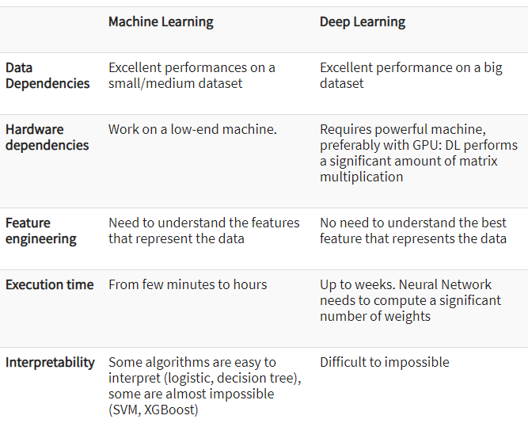
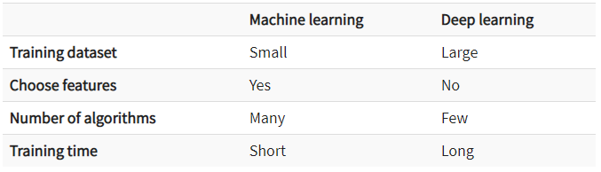

# Difference between AI, ML and DL

### What is AI ?

**AI (Artificial Intelligence) involves machines that can perform tasks that are characteristic of human intelligence.** While this is rather general, it includes things like planning, understanding language, recognizing objects and sounds, learning, and problem-solving.

**AI has three different levels:**

1. **Narrow AI:** A artificial intelligence is said to be narrow when the machine can perform a specific task better than a human. `The current research of AI is here now.`
2. **General AI:** An artificial intelligence reaches the general state when it can perform any intellectual task with the same accuracy level as a human would
3. **Active AI:** An AI is active when it can beat humans in many tasks

### What is ML ?

**Machine learning** is the best tool so far to analyze, understand and identify a pattern in the data. One of the main ideas behind machine learning is that the computer can be trained to automate tasks that would be exhaustive or impossible for a human being. 

The clear breach from the traditional analysis is that machine learning can take decisions with minimal human intervention.

Machine learning uses data to feed an algorithm that can understand the relationship between the input and the output. When the machine finished learning, it can predict the value or the class of new data point.

##### What is the machine learning Model?
The machine learning model is nothing but a piece of code; an engineer or data scientist makes it smart through training with data. So, if you give garbage to the model, you will get garbage in return, i.e. the trained model will provide false or wrong predictions.

### What is DL ?

**Deep learning** is a computer software that mimics the `network of neurons` in a brain. It is a subset of machine learning and is called deep learning because it makes use of deep `neural networks`. A neural network is an architecture where the layers are stacked on top of each other.

The machine uses different layers to learn from the data. The depth of the model is represented by the number of layers in the model. Deep learning is the new state of the art in term of AI.

### Difference between ML and DL

### When to use ML or DL?

In the table below, we summarize the difference between machine learning and deep learning.

# Types of ML

### Supervised Learning

Supervised learning is the one done under the supervision of a teacher or a supervisor. Basically, the model is trained over a `labeled dataset`. A labeled database is one which contains both inputs as well as the output parameters. Here the trained dataset act a teacher, and its primary role is to train the model. The prediction is made once the model is built. It works in the same manner as the student learns under the supervision of the teacher. 

In the supervised learning, the `input`, as well as the `output`, is provided to the model aiming to find a mapping function that maps an input variable (P) to the output variable (Q). 

The supervised learning is used for fraud detection, risk assessment, spam filtering, etc.

In supervised learning algorithms, the predicted output could be a discrete/categorical value or it could be a continuous value based on the type of scenario considered and the dataset taken into consideration. If the output predicted is a `discrete/categorical` value, such algorithms fall under the `classification algorithms`, and if the output predicted is a `continuous` value, such algorithms fall under the `regression algorithms.`

### Unsupervised Learning

In this learning pattern, there is no supervision done to the model to make it learn. The model learns by itself based on the data fed to it and provides us with patterns it has learned.

These algorithms are very useful where a feature set is too large and the human user doesn't know what to look for in the data.

The following diagram will give you an idea of what unsupervised learning is. The data without labels is given as input to build the model through unsupervised learning algorithms. This is the **Training Phase**. Then the model is used to predict the proper patterns for any input data without the label. This is the **Testing Phase**.

In this family of algorithms, which is also based on the input data fed to the model and the method adopted by the model to infer patterns in the dataset, there emerge two common categories of algorithms. These are `clustering` and `association rule mapping` algorithms. 

### Semi-supervised Learning

In the previous two types, either there are no labels for all the observations in the dataset or labels are present for all the observations. Semi-supervised learning falls in between these two. In many practical situations, the cost of labeling is quite high, since it requires skilled human experts to do that. So, if labels are absent in the majority of the observations, but present in a few, then semi-supervised algorithms are the best candidates for the model building. 

**Speech analysis is one example of a semi-supervised learning model**. Labeling audio files is very costly and requires a very high level of human effort. Applying semi-supervised learning models can really help to improve traditional speech analytic models.

In this class of algorithms, also based on the output predicted, which may be categorical or continuous, the algorithm family could be regression or classification. 

### Reinforcement Learning

Reinforcement learning is `goal-oriented` learning based on interactions with the environment. A reinforcement learning algorithm (called the **agent**) continuously learns from the environment in an iterative fashion. In the process, the agent learns from its experiences of the environment until it explores the full range of possible states and is able to reach the `target state`.

Let's take the example of a child learning to ride a bicycle. The child tries to learn by riding it, it may fall, it will understand how to balance, how to continue the flow without falling, how to sit in the proper position so that weight is not moved to one side, studies the surface, and also plans actions as per the surface, slope, hill, and so on. So, it will learn all possible scenarios and states required to learn to ride the bicycle. A fall may be considered as negative feedback and the ability to ride along stride may be a positive reward for the child. This is classic reinforcement learning. This is the same as what the model does to determine the ideal behavior within a specific context, in order to maximize its performance. Simple reward feedback is required for the agent to learn its behavior; this is known as the **reinforcement signal**.

# Developmental phases of Machine Learning application

We can define the machine learning workflow in 5 stages.

1. **Gathering data**
2. **Data pre-processing**
3. **Researching the model that will be best for the type of data**
4. **Training and testing the model**
5. **Evaluation**

#### 1. Gathering data
The process of gathering data depends on the type of project we desire to make, if we want to make an ML project that uses real-time data, then we can build an IoT system that using different sensors data. The data set can be collected from various sources such as a file, database, sensor and many other such sources but the collected data cannot be used directly for performing the analysis process as there might be a lot of missing data, extremely large values, unorganized text data or noisy data. Therefore, to solve this problem Data Preparation is done.

We can also use some free data sets which are present on the internet. [Kaggle](http://www.kaggle.com/) and [UCI Machine learning](https://archive.ics.uci.edu/ml/datasets.html) Repository are the repositories that are used the most for making Machine learning models.

#### 2. Data pre-processing
Data pre-processing is one of the most important steps in machine learning. It is the most important step that helps in building machine learning models more accurately. In machine learning, there is an **80/20 rule**. Every data scientist should spend 80% time for data pre-processing and 20% time to actually perform the analysis.

**What is data pre-processing?**
`Data pre-processing` is a process of cleaning the raw data i.e. the data is collected in the real world and is converted to a clean data set. In other words, whenever the data is gathered from different sources it is collected in a raw format and this data isn’t feasible for the analysis.
Therefore, certain steps are executed to convert the data into a small clean data set, this part of the process is called as data pre-processing.

**Why do we need it?**
As we know that data pre-processing is a process of cleaning the raw data into clean data, so that can be used to train the model. So, we definitely need data pre-processing to achieve good results from the applied model in machine learning and deep learning projects.

Most of the real-world data is messy, some of these types of data are:

1. **Missing data:** Missing data can be found when it is not continuously created or due to technical issues in the application (IOT system).
2. **Noisy data:** This type of data is also called outliners, this can occur due to human errors (human manually gathering the data) or some technical problem of the device at the time of collection of data.
3. **Inconsistent data:** This type of data might be collected due to human errors (mistakes with the name or values) or duplication of data.

**Three Types of Data**

1. **Numeric** e.g. income, age
2. **Categorical** e.g. gender, nationality
3. **Ordinal** e.g. low/medium/high

**How can data pre-processing be performed?**
These are some of the basic pre — processing techniques that can be used to convert raw data.
1. **Conversion of data:** As we know that Machine Learning models can only handle numeric features, hence categorical and ordinal data must be somehow converted into numeric features.
2. **Ignoring the missing values:** Whenever we encounter missing data in the data set then we can remove the row or column of data depending on our need. This method is known to be efficient but it shouldn’t be performed if there are a lot of missing values in the dataset.
3. **Filling the missing values:** Whenever we encounter missing data in the data set then we can fill the missing data manually, most commonly the mean, median or highest frequency value is used.
4. **Machine learning:** If we have some missing data then we can predict what data shall be present at the empty position by using the existing data.
5. **Outliers detection:** There are some error data that might be present in our data set that deviates drastically from other observations in a data set. [Example: human weight = 800 Kg; due to mistyping of extra 0]

#### 3. Researching the model that will be best for the type of data
Our main goal is to train the best performing model possible, using the pre-processed data.

#### 4. Training and testing the model on data
For training a model we initially split the model into 3 three sections which are `‘Training data’` ,`‘Validation data’` and `‘Testing data’`.

You train the classifier using `‘training data set’`, tune the parameters using `‘validation set’` and then test the performance of your classifier on unseen `‘test data set’`. An important point to note is that during training the classifier only the training and/or validation set is available. The test data set must not be used during training the classifier. The test set will only be available during testing the classifier.

- **Training set:** The training set is the material through which the computer learns how to process information. Machine learning uses algorithms to perform the training part. A set of data used for learning, that is to fit the parameters of the classifier.
- **Validation set:** Cross-validation is primarily used in applied machine learning to estimate the skill of a machine learning model on unseen data. A set of unseen data is used from the training data to tune the parameters of a classifier.
- **Test set:** A set of unseen data used only to assess the performance of a fully-specified classifier.

Once the data is divided into the 3 given segments we can start the training process.

In a data set, a training set is implemented to build up a model, while a test (or validation) set is to validate the model built. Data points in the training set are excluded from the test (validation) set. Usually, a data set is divided into a training set, a validation set (some people use ‘test set’ instead) in each iteration, or divided into a training set, a validation set and a test set in each iteration.

The model uses any one of the models that we had chosen in step 3/ point 3. Once the model is trained we can use the same trained model to predict using the testing data i.e. the unseen data. Once this is done we can develop a confusion matrix, this tells us how well our model is trained. A confusion matrix has 4 parameters, which are **‘True positives’**, **‘True Negatives’**, **‘False Positives’** and **‘False Negative’**. We prefer that we get more values in the True negatives and true positives to get a more accurate model. The size of the Confusion matrix completely depends upon the number of classes.

- **True positives :** These are cases in which we predicted TRUE and our predicted output is correct.
- **True negatives :** We predicted FALSE and our predicted output is correct.
- **False positives :** We predicted TRUE, but the actual predicted output is FALSE.
- **False negatives :** We predicted FALSE, but the actual predicted output is TRUE.

We can also find out the accuracy of the model using the confusion matrix.

>Accuracy = (True Positives +True Negatives) / (Total number of classes)

i.e. for the above example:

>Accuracy = (100 + 50) / 165 = 0.9090 (90.9% accuracy)

#### Evaluation
Model Evaluation is an integral part of the model development process. It helps to find the best model that represents our data and how well the chosen model will work in the future.

To improve the model we might tune the hyper-parameters of the model and try to improve the accuracy and also looking at the confusion matrix to try to increase the number of true positives and true negatives.