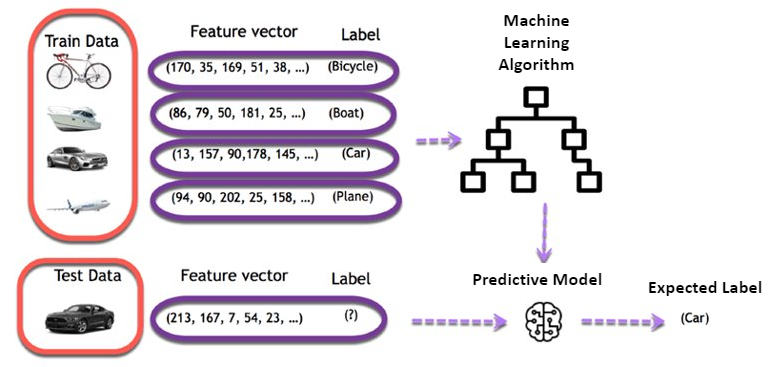
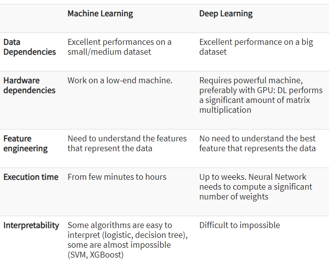
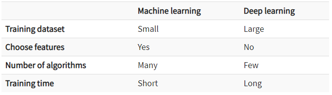

# Difference between AI, ML and DL

### What is AI ?

**AI (Artificial Intelligence) involves machines that can perform tasks that are characteristic of human intelligence.** While this is rather general, it includes things like planning, understanding language, recognizing objects and sounds, learning, and problem-solving.

**AI has three different levels:**

1. **Narrow AI:** A artificial intelligence is said to be narrow when the machine can perform a specific task better than a human. `The current research of AI is here now.`
2. **General AI:** An artificial intelligence reaches the general state when it can perform any intellectual task with the same accuracy level as a human would
3. **Active AI:** An AI is active when it can beat humans in many tasks

### What is ML ?

**Machine learning** is the best tool so far to analyze, understand and identify a pattern in the data. One of the main ideas behind machine learning is that the computer can be trained to automate tasks that would be exhaustive or impossible for a human being. 

The clear breach from the traditional analysis is that machine learning can take decisions with minimal human intervention.

Machine learning uses data to feed an algorithm that can understand the relationship between the input and the output. When the machine finished learning, it can predict the value or the class of new data point.

##### What is the machine learning Model?
The machine learning model is nothing but a piece of code; an engineer or data scientist makes it smart through training with data. So, if you give garbage to the model, you will get garbage in return, i.e. the trained model will provide false or wrong predictions.

### What is DL ?

**Deep learning** is a computer software that mimics the `network of neurons` in a brain. It is a subset of machine learning and is called deep learning because it makes use of deep `neural networks`. A neural network is an architecture where the layers are stacked on top of each other.

The machine uses different layers to learn from the data. The depth of the model is represented by the number of layers in the model. Deep learning is the new state of the art in term of AI.

### Difference between ML and DL

### When to use ML or DL?

In the table below, we summarize the difference between machine learning and deep learning.

# Types of ML

### Supervised Learning

Supervised learning is the one done under the supervision of a teacher or a supervisor. Basically, the model is trained over a `labeled dataset`. A labeled database is one which contains both inputs as well as the output parameters. Here the trained dataset act a teacher, and its primary role is to train the model. The prediction is made once the model is built. It works in the same manner as the student learns under the supervision of the teacher. 

In the supervised learning, the `input`, as well as the `output`, is provided to the model aiming to find a mapping function that maps an input variable (P) to the output variable (Q). 

The supervised learning is used for fraud detection, risk assessment, spam filtering, etc.

In supervised learning algorithms, the predicted output could be a discrete/categorical value or it could be a continuous value based on the type of scenario considered and the dataset taken into consideration. If the output predicted is a `discrete/categorical` value, such algorithms fall under the `classification algorithms`, and if the output predicted is a `continuous` value, such algorithms fall under the `regression algorithms.`

### Unsupervised Learning

In this learning pattern, there is no supervision done to the model to make it learn. The model learns by itself based on the data fed to it and provides us with patterns it has learned.

These algorithms are very useful where a feature set is too large and the human user doesn't know what to look for in the data.

The following diagram will give you an idea of what unsupervised learning is. The data without labels is given as input to build the model through unsupervised learning algorithms. This is the **Training Phase**. Then the model is used to predict the proper patterns for any input data without the label. This is the **Testing Phase**.

In this family of algorithms, which is also based on the input data fed to the model and the method adopted by the model to infer patterns in the dataset, there emerge two common categories of algorithms. These are `clustering` and `association rule mapping` algorithms. 

### Semi-supervised Learning

In the previous two types, either there are no labels for all the observations in the dataset or labels are present for all the observations. Semi-supervised learning falls in between these two. In many practical situations, the cost of labeling is quite high, since it requires skilled human experts to do that. So, if labels are absent in the majority of the observations, but present in a few, then semi-supervised algorithms are the best candidates for the model building. 

**Speech analysis is one example of a semi-supervised learning model**. Labeling audio files is very costly and requires a very high level of human effort. Applying semi-supervised learning models can really help to improve traditional speech analytic models.

In this class of algorithms, also based on the output predicted, which may be categorical or continuous, the algorithm family could be regression or classification. 

### Reinforcement Learning

Reinforcement learning is `goal-oriented` learning based on interactions with the environment. A reinforcement learning algorithm (called the **agent**) continuously learns from the environment in an iterative fashion. In the process, the agent learns from its experiences of the environment until it explores the full range of possible states and is able to reach the `target state`.

Let's take the example of a child learning to ride a bicycle. The child tries to learn by riding it, it may fall, it will understand how to balance, how to continue the flow without falling, how to sit in the proper position so that weight is not moved to one side, studies the surface, and also plans actions as per the surface, slope, hill, and so on. So, it will learn all possible scenarios and states required to learn to ride the bicycle. A fall may be considered as negative feedback and the ability to ride along stride may be a positive reward for the child. This is classic reinforcement learning. This is the same as what the model does to determine the ideal behavior within a specific context, in order to maximize its performance. Simple reward feedback is required for the agent to learn its behavior; this is known as the **reinforcement signal**.

