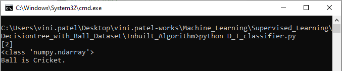

# Ball_Prediction Case Study

### Problem statement:

> There are multiple types of balls in our data set as cricket ball and tennis ball. This type of balls is classified based on its weight and its surface. We must design application using machine learning strategy which is used to classify the balls.

### Dataset Description

- **features ->** Weight, Surface
- **Label ->** Tennis , Cricket

### Library Installation

> pip install sklearn

### Algorithm

> DecisionTreeClassifier from sklearn

### Initial script

We had import DecisionTreeClassifier class from sklearn.tree and call the fit() method along with our training data.

```
from sklearn import tree
model = tree.DecisionTreeClassifier()
model.fit(data,target_label)
```

Now that we have trained our algorithm, it’s time to make some predictions. To do so, we will use our test data. To make predictions on the test data, execute the following script:

```
result = model.predict([[99,0]])
```

### Output




