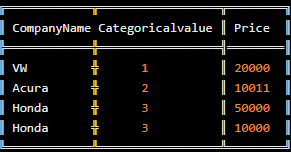
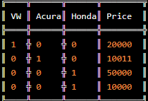

# What is One Hot Encoding? Why And When do you have to use it?

One hot encoding is a process by which categorical variables are converted into a form that could be provided to ML algorithms to do a better job in prediction.

Say suppose the dataset is as follows:

The categorical value represents the numerical value of the entry in the dataset. For example: if there were to be another company in the dataset, it would have been given categorical value as 4. As the number of unique entries increases, the categorical values also proportionally increases.

The previous table is just a representation. In reality, the categorical values start from **0** goes all the way up to **N-1** categories.

Now let’s get back to one hot encoding: Say we follow instructions as given in the sklearn’s documentation for one hot encoding and follow it with a little cleanup, we end up with the following:

After one hot encoding -

0 indicates non existent while 1 indicates existent.

### Why do you need one hot encoding?

Problem with label encoding is that it assumes higher the categorical value, better the category.

**Example:**

 What this form of organization presupposes is VW > Acura > Honda based on the categorical values. Say supposing your model internally calculates average, then accordingly we get, 1+3 = 4/2 =2. This implies that: Average of VW and Honda is Acura. This is definitely a recipe for disaster. This model’s prediction would have a lot of errors.
 
This is why we use one hot encoder to perform “binarization” of the category and include it as a feature to train the model.
Another Example: Suppose you have ‘flower’ feature which can take values ‘daffodil’, ‘lily’, and ‘rose’. One hot encoding converts ‘flower’ feature to three features, ‘is_daffodil’, ‘is_lily’, and ‘is_rose’ which all are binary.